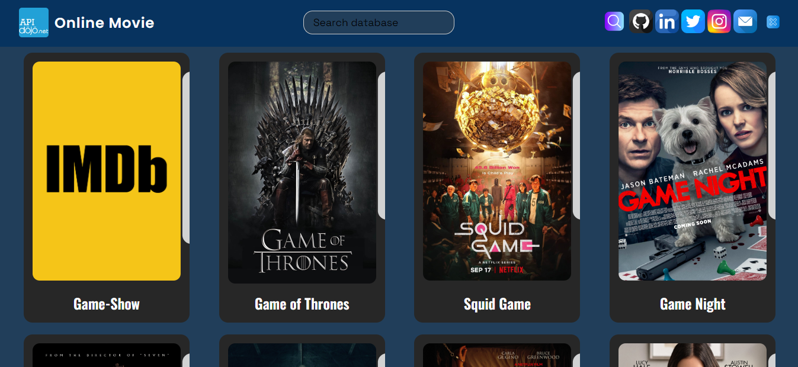

# JS-Project-7- Online Movie

##JS HTMl CSS ile hazırlanmış projedir.

### udemig eğitim çalışmasıdır...

# Online Movie

Veritabanında Verileri alıp ekrana yansıtan
ve verileri ekrana yanstılan movie projesidir.

## Kaynaklar

- API: https://rapidapi.com/
- Temel Url: https://online-movie-database.p.rapidapi.com/auto-complete?q=game

## İçeriği

- Statik bir header
- Soysal menü açılır kapanır
- search image ile açılır kapanır

- API'den movie objeleri alındı ve ekrana yansıtıldı

- Movie poster ieçriği açılır kapanır card ile düzenlendi.

## Preview

# RapidApi-Movie
